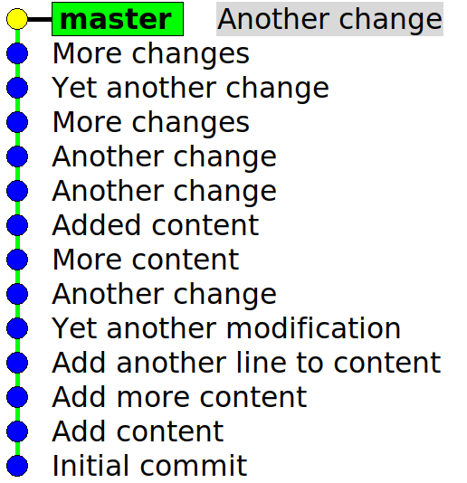
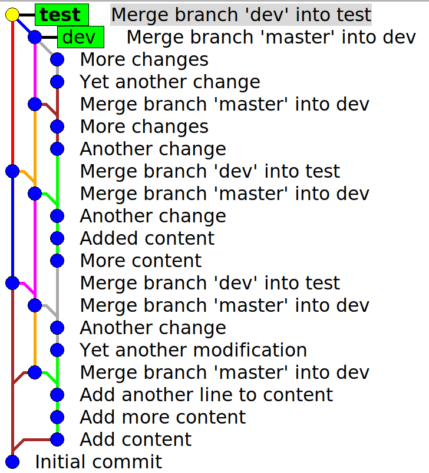
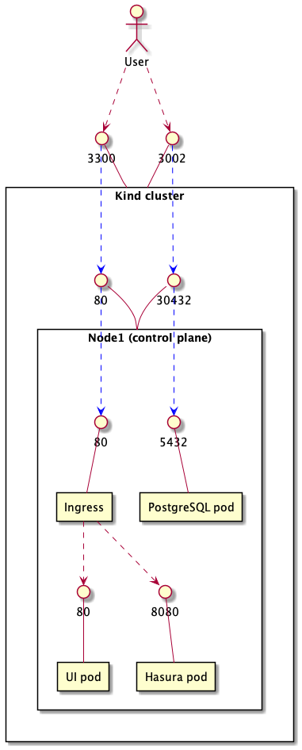

<!-- markdownlint-disable MD025 MD040 MD034 -->

# jore4-flux

Flux configuration for the jore4 Kubernetes deployment

<!-- regenerate with: "./development.sh toc" -->
<!-- START doctoc generated TOC please keep comment here to allow auto update -->
<!-- DON'T EDIT THIS SECTION, INSTEAD RE-RUN doctoc TO UPDATE -->

- [Preliminaries](#preliminaries)
- [Concept](#concept)
  - [Flux](#flux)
  - [Kustomize](#kustomize)
- [Deployment Strategy](#deployment-strategy)
  - [Basic Idea](#basic-idea)
  - [Trackability](#trackability)
  - [Branching](#branching)
  - [Rebasing](#rebasing)
  - [Rollback and Hotfixes](#rollback-and-hotfixes)
- [Directory Structure](#directory-structure)
  - [CRDs](#crds)
  - [Cluster Definitions](#cluster-definitions)
- [Development](#development)
  - [Generate Kubernetes and Docker-Compose configurations](#generate-kubernetes-and-docker-compose-configurations)
  - [Deploying a new microservice](#deploying-a-new-microservice)
  - [Generate Flux configurations](#generate-flux-configurations)
  - [Troubleshooting](#troubleshooting)
    - [Testing Kustomize](#testing-kustomize)
    - [Pods](#pods)
    - [Uninstall](#uninstall)
    - [Flux Monitoring](#flux-monitoring)
- [Use in end-to-end tests](#use-in-end-to-end-tests)
  - [Kind](#kind)
    - [Setting up Kind cluster locally](#setting-up-kind-cluster-locally)
    - [Setting up Kind cluster remotely](#setting-up-kind-cluster-remotely)
    - [Development of Kind cluster](#development-of-kind-cluster)
    - [Architecture and port mapping in Kind cluster](#architecture-and-port-mapping-in-kind-cluster)
    - [Differences between AKS and Kind](#differences-between-aks-and-kind)
  - [Docker-compose](#docker-compose)

<!-- END doctoc generated TOC please keep comment here to allow auto update -->

## Preliminaries

For running the commands in this README, you'll need to following:

- [Kubectl](https://kubernetes.io/docs/tasks/tools/)
- [Kustomize](https://kustomize.io/)
- [Flux](https://fluxcd.io/)
- [Kind](https://kind.sigs.k8s.io/)

Optionally, you may want to install:

- [Lens](https://k8slens.dev/)

## Concept

### Flux

[Flux](https://fluxcd.io/) is a GitOps Kubernetes extension which keeps on polling
sources (git/helm repositories) for changes. It has to be deployed to a
cluster once (see instructions below), then it will keep on working and updating
itself.

Whenever there's a change in the git/helm/docker repositories, it automatically
(re)deploys the desired resources to the cluster. Note that Flux also stores its
own components and configurations as Kubernetes resources, so it also
automatically updates its own configuration (sync settings) the same way as it
can redeploy applications.

Flux automatically accesses the cluster from inside, without having to allow an
IP address through the Network Security Group or creating a machine user
(service principal) for CI.

Flux periodically (currently once a minute) checks for differences in the Kubernetes
cluster from the desired state. When there's a change, it automatically reconciles.
As a drawback, this also means that you cannot (easily) manually deploy a specific
version to the cluster, as flux will return the cluster to the latest version that
matches the configuration. E.g. if flux is set to deploy version `1.3.1`, you cannot
manually deploy a `1.5.7` version as it will be reconciled back to `1.3.1`.

### Kustomize

In our case, Flux uses [Kustomize](https://kustomize.io/) to gather all the
Kubernetes resources that are to be deployed. Note the confusing terminology that
Kubernetes's `kustomize.config.k8s.io/v1beta1` `Kustomize` resource is used to bundle
resources while flux's `kustomize.toolkit.fluxcd.io/v1beta1` `Kustomize`
resource is used to define monitoring rules.

Kustomize uses the terms "bases" and "overlays", in practice taking Kubernetes
resource yamls as base templates and applies overlay patch yamls on top of them to
customize for different environments.

Kustomize restrictions:

- cannot directly reference resources or patches in another directory, have to reference
  a whole directory (instead of `../base/mypatch.yaml` have to reference `../base` where
  `../base/kustomization.yaml` references the `./mypatch.yaml`)
- Kustomize does not allow direct variable injection (e.g. cannot do `dockerImage: $VAR`)
- Kustomize has two major ways of "editing" a yaml file:
  - [patchesJson6902](https://kubectl.docs.kubernetes.io/references/kustomize/kustomization/patchesjson6902/)
    requires the _caller_ to define the target resource the patch should be applied to
  - [patchesStrategicMerge](https://kubectl.docs.kubernetes.io/references/kustomize/kustomization/patchesstrategicmerge/)
    allows the _patch_ to define the target resource, but the syntax is very verbose

## Deployment Strategy

### Basic Idea

- The current Flux setup is monitoring changes in `playg`, `dev`, `test` and `prod` branches.
- Other branches don't affect the deployment. Also you need to remember to push the branches to github :)
- When the branch is moved to a different commit, Flux picks up the configuration: `./clusters/dev`
  for `dev` branch, `./clusters/test` for `test` branch and so on. Flux
  tries to deploy the given configuration and sends a message to Slack when it succeeds/fails (slack notification to be implemented later).

### Trackability

We have to following rules for the deployments' trackability:

_Rule 1:_ We should be able to pinpoint that at what _time_ in what _stage_ what _version_ was
deployed. We are aiming to use the git history for this, which is of course not 100% reliable,
because:

- failed deployments don't show in the git history
- deployments only happen if the commit is actually pushed to github
- users can rewrite git history with force push
- deployments take some time

We are assuming here that git commits contain configurations which will succeed to deploy and the
time delay is negligible.

_Rule 2:_ We should be able to _confidently_ push versions to `prod`, knowing that if the same configuration
worked in `playg`, `dev` and `test`, it will also work in `prod`. This implies that we have to minimize the
difference between the `playg`, `dev`, `test` and `prod` deployment configurations and that we ensure that
all the tested changes in the `dev` configurations will be fluently propagated to `test` and `prod`.

### Branching

We will use the `main` branch to store the deployment configurations for _all_ stages. Every time
you make a change to the deployment configuration, create a `feature branch` with the changes and
a pull request to merge these changes to `main`. Both the developer and the reviewer should make
sure that all the changes are applied to all `dev`, `test` and `prod` cluster configurations. At this
point, the deployment configuration changes don't get deployed to the different stages as `dev`,
`test` and `prod` branches haven't been touched. This should ensure Trackability Rule 2 to be
implemented.

The `playg` branch can be freely moved around to any commit. Its purpose is to allow fast and easy testing of a new cluster setup in Azure.

Whenever deploying a version to a `dev`/`test`/`prod` stages, you should use no-fast-forward git merging to make sure that at
least an empty commit is created to testify about the configuration change in the given stage
(Trackability Rule 1). For `dev` stage, it should look like this:

```
git checkout dev
git merge --no-ff main
```

You should always test your deployment changes in `dev` first, then in `test`, then `prod`.
Propagating changes to `test` and `prod` work similarly:

```
git checkout test
git merge --no-ff dev
```

These operations will make your git history look like this for the `main` branch:



And this is how the git history looks when changes are propagated to the `dev` and `test` branches.
Propagating to `prod` works the same, it's been omitted from the image for clarity.



### Rebasing

Sometimes you may need to rebase your changes, e.g. when fixing a mistake in your commit. The default
`git rebase` command discards the empty merge commits, so use `git rebase -i --rebase-merges [commit]`
to preserve them.

### Rollback and Hotfixes

When rolling back changes to the deployment configuration, you should never reset a branch to an
older commit using e.g. `git reset --hard [commit]`, because you will lose the information from the
git history that for a while a faulty configuration was deployed. Instead, always create a new commit
to the `main` branch that reverts the changes back to the desired state and propagate it the usual way
to `dev`, `test` and then `prod`.

In case you want to do a hotfix in production for a critical issue, you should create the hotfix
commit directly in `prod`. Remember to also cherry-pick it to `main` to avoid merge conflicts later
on. However avoid hotfixing and strive to test your changes properly in `dev` and `test`.

## Directory Structure

### CRDs

The cluster uses the following Custom Resource Definitions (~ Kubernetes plugins):

- Flux (can be found from `crd/flux-crd.yaml`)
- [Secret Store CSI Driver](https://github.com/Azure/secrets-store-csi-driver-provider-azure)
  for Azure key-vault binding (using helm chart to install)

To be able to create special resources (like secret provider mapping), you need to deploy the
CRDs first with `./kubernetes.sh deploy:crd <stage>`

### Cluster Definitions

The cluster definitons can be found from `clusters/dev`, `clusters/test` and
`clusters/prod`. For example, `dev` includes the following:

- `flux-sync.yaml` tells Flux what repository (`jore4-flux`), branch (`dev`) and folder
  (`clusters/dev`) to watch for changes. Note that `flux-sync.yaml` is also in this folder,
  meaning the flux is monitoring for changes in its on sync configuration file.
- `kustomization.yaml` loads the base resources templates `jore4-services` and
  `jore4-secret-bindings` and applies `dev` stage-specific patches
- `*-patch.yaml` files describe all the customization patches to the base templates to
  form the `dev` environment

Deploy the `dev` cluster with `./kubernetes.sh deploy:cluster dev`

To make sure that all stages' cluster definitions are the same (except of course the stage-specific
configurations), we are [generating the yamls](#yaml-templates) with gomplate

Clusters have [LimitRange](https://kubernetes.io/docs/concepts/policy/limit-range/) defined to avoid
memory/CPU leaks for misbehaving containers. These resource limits are defined tight to identify
resource bottlenecks early. These limits can be set for the whole namespace and can be overridden
also for individual pods.
[See here](https://kubernetes.io/docs/tasks/administer-cluster/manage-resources/)

## Development

### Generate Kubernetes and Docker-Compose configurations

To help creating generic configurations for Kubernetes and Docker-Compose,
we are using [gomplate](https://docs.gomplate.ca/) for rendering yaml templates. This is the same tool
that Helm uses to render its charts, we are also aiming to keep a similar directory structure to
support switching to Helm easy in case the need emerges in the future.

The templates are found from `/generate/templates`:

- `resources`: individual resource definition template pieces (e.g. deployment, service, configmap)
  from which other bigger templates are building
- `kubernetes-all`: templates that all clusters should render (e2e, playg, dev, test, prod)
- `kubernetes-azure-only`: templates that azure clusters should additionally render (e.g. flux sync file)
- `kubernetes-local-only`: templates that local clusters should additionally render (e.g. test databases)
- `docker-compose`: template that renders into a docker-compose.yaml file.

The substituted values can be found from `/generate/values`:

- `common.yaml`: general definition/configuration of all microservices, with default values
- `e2e|playg|dev|test|prod.yaml`: stage-specific overwrites of the common defaults

To rerender all yaml templates for all stages, run `./development.sh generate`

- Generated Kubernetes clusters (`e2e`,`playg`,`dev`,`test`,`prod`) will have the following files:
  - flux-sync.yaml: for flux configurations
  - jore4-namespace.yaml: for creating the namespace
  - jore4-ingress.yaml: for creating the ingress
  - jore4-\*.yaml: for creating the microservices
  - kustomization.yaml: for bundling this all to a deployable package for Kustomize/Flux
- Generated Docker-Compose setup will have the following files:
  - docker-compose.yaml: the actual docker-compose config
  - secret-\*: secret files to feed usernames & passwords to the containers
  - nginx.conf: to parameterize the ingress proxy

### Deploying a new microservice

1. Describe the new microservice in `generate/values/common.yaml`. For reference, see how other
   microservices are created
1. Create a new service manifest in `generate/templates/kubernetes-all`. If you don't need anything
   custom additions, you could just copy-paste the template from another microservice and rename relevant parts
1. If the service has an HTTP endpoint that needs to be accessed externally, create the ingress rule
   in all environments `generate/values/<dev|e2e|playg|prod|test|...>.yaml`
1. If there are other customizations to be done to the service (e.g. needs different environment
   variables in different stages), edit the relevant parts in
   `generate/values/<dev|e2e|playg|prod|test|...>.yaml`
1. Generate the manifests using `./development.sh generate`
1. Test locally that everything works:
   1. with docker-compose: `docker-compose -f clusters/docker-compose/docker-compose.yml up`
   1. with Kind: `./kindcluster.sh start --cluster=clusters/e2e`
   1. with Azure: commit your changes, move `playg` branch to your the commit and wait for Flux to
      deploy it for you
1. Testing with CI/CD:
   1. Kind cluster remote setup: extend the `patchesStrategicMerge` section in `/remotecluster.sh`
      to allow switching the docker image to another one in e2e tests.
   1. Kind cluster github testing: extend all jobs with your microservice in
      `.github/workflows/test-e2e-cluster-setup.yml`
   1. Docker compose github testing: extend all jobs with your microservice in
      `.github/workflows/test-e2e-docker-compose.yml`

### Generate Flux configurations

Sometimes you might want to generate Flux configurations with the CLI instead of
manually editing the existing `flux-*.yaml` files. However, I do advise that you
should manually edit at least the `flux-sync.yaml` file instead of generating
it, because the Flux CLI is just writing the .yaml file for you that is already
pretty simple to just edit in a text editor. To update Flux however I advise on
using the CLI to update the `flux-crd.yaml` file.

Here are some instructions for the manual bootstrapping process. If you want to
understand better what's happening here, check the
[official documentation](https://toolkit.fluxcd.io/guides/installation/#generic-git-server).

1. log in to kubernetes (az login, az aks get-credentials... or
   `./kubernetes.sh login dev`)

1. check that Flux prerequisites are OK in the cluster `flux check --pre`

1. generate custom resource definitions for setting up Flux system in kubernetes (monitoring
   controllers). Use the `--version` parameter to specify which version to generate CRDs for.
   Available versions are found from [here](https://github.com/fluxcd/flux2/releases)
   `flux install --network-policy=false --export --version 0.13.2 > crd/flux-crd.yaml`

1. generate a manifest for this git repository to have `dev` branch monitored as a "source":

```
flux create source git flux-repo \
--url=https://github.com/HSLdevcom/jore4-flux \
--branch=dev \
--interval=1m \
--export > clusters/dev/flux-sync.yaml`
```

1. generate a manifest for Flux sync configurations themselves be monitored. The monitored
   directory should have a `kustomization.yaml` file in it

```
flux create kustomization flux-system-sync \
--source=flux-repo \
--path="./clusters/dev" \
--prune=true \
--interval=1m \
--export >> clusters/dev/flux-sync.yaml`
```

(this will examine if there are any changes in `clusters/dev` from the `jore4-flux` git
repository every minute. The current setup has both flux sync configurations and the jore4
application configurations in the same `clusters/dev` folder)

### Troubleshooting

#### Testing Kustomize

For bundling resources and templating, we use Kustomizations. Unfortunately
`kubectl apply -k ...` uses an old version of Kustomize, so we rather have to
build the Kustomizations ourselves and apply them as patches, like this:
`kustomize build clusters/dev | kubectl apply -f -`

To test whether Kustomize builds and patches the templates correctly, just call
`kustomize build` pointing to a directory with a `kustomization.yaml` in it. E.g.
`kustomize build clusters/dev`

#### Pods

[Lens](https://k8slens.dev/) is a quite good UI providing you insight to the cluster.

Flux is deployed to Kubernetes, its controllers are run in pods. For checking
all pods' status, use `kubectl get pods -A`. For checking Flux's pods, use
`kubectl get pods --namespace flux-system`. To viewing the logs of a single pod
in the Flux namespace, use `kubectl logs XXX --namespace flux-system`.

If the Flux controller pods don't start, you may need to increase the number of nodes that
are assigned for Kubernetes (`env-dev.yaml` in `jore4-deploy` repository). For
other startup-related issues, see the
[docs](https://kubernetes.io/docs/tasks/debug-application-cluster/debug-application/).

#### Uninstall

If you want to uninstall Flux from the cluster, simply call `flux uninstall --namespace=flux-system`.

On some rare occasions however the Kubernetes destroy finalizer does not get called and the
namespace does not get deleted. To clean up:

1. retrieve the current namespace manifest with
   `kubectl get namespace flux-system -o json > tmp.json`
1. edit `tmp.json` and remove "kubernetes" from finalizers
1. `kubectl replace --raw "/api/v1/namespaces/flux-system/finalize" -f tmp.json`

Alternatively, you may apply the changes in `tmp.json` through the REST API

1. open another terminal and run `kubectl proxy`
1. patch the cluster namespace manifest with
   `curl -k -H "Content-Type: application/json" -X PUT --data-binary @tmp.json https://localhost:8001/api/v1/namespaces/flux-system/finalize`

#### Flux Monitoring

To see what Kustomizations currently are deployed by Flux, use `watch flux get kustomizations`. If
there's a wrong version deployed:

1. wait for the reconciliation timeout (1 minute) to pass
1. if still a wrong version, see the Flux controller pods' logs what went wrong
   `kubectl logs XXX-controller-YYY --namespace flux-system`
1. may also see that the new kubernetes configuration got applied, but some pods fail to start. Find
   the misbehaving pod with `kubectl get pods -A` and check its logs with
   `kubectl logs <pod-name> --namespace <pod-namespace>` (or use Lens)

## Use in end-to-end tests

### Kind

To run the cluster locally in kubernetes, we are using
[kind](https://kind.sigs.k8s.io/docs/user/quick-start#installation).

#### Setting up Kind cluster locally

To start Kind, execute `./kindcluster.sh kind:start`, to stop, run `./kindcluster.sh stop`.
This will create a cluster called `kind-jore4-local-cluster` that works pretty much the same as the
AKS Kubernetes service. To fine-tune its settings, edit the `kind-cluster.yaml` file. More
information about the available settings [here](https://kind.sigs.k8s.io/docs/user/configuration/).

You may use the same `./kindcluster.sh deploy:*` commands to deploy CRDs and applications to Kind as
with the AKS. To start the cluster for end-to-end testing, just execute:

```
./kindcluster.sh kind:start
./kindcluster.sh deploy:crd
./kindcluster.sh deploy:cluster --cluster=clusters/e2e
```

Or simply:

```
./kindcluster.sh start --cluster=clusters/e2e
```

This will start up the JORE4 cluster that's defined in `clusters/e2e` directory.

- The UI runs on `http://localhost:3300`
- The postgresql database is exposed on `localhost:3002` (credentials are defined in
  `clusters/e2e/jore4-local-secrets.yaml`)

We don't use Flux to set up the applications within the Kind Kubernetes as it would just slow things
down. Instead, the resources are deployed directly.

#### Setting up Kind cluster remotely

To set up and run the Kind cluster remotely, from e.g. a github action instead of your local workdir,
there is a `remotecluster.sh` script in the repo root that downloads the necessary configuration
files and helper scripts from the `jore4-flux` repository from the `e2e` branch and instructs
`kindcluster.sh` to deploy the e2e cluster to Kind. The `e2e` branch follows the same logic as the
[Deployment Strategy](#deployment-strategy) describes.

Just download the `remotecluster.sh` and execute it on your machine to have the full setup done. You
may also execute it directly with:

```
curl https://raw.githubusercontent.com/HSLdevcom/jore4-flux/e2e/remotecluster.sh | bash
```

The script recognizes the following environment variables as parameters:

- `UI_DOCKER_IMAGE`: redefines which UI docker image should be used instead of the e2e
  cluster default. E.g `UI_DOCKER_IMAGE="hsldevcom/jore4-ui:latest"`
- `HASURA_DOCKER_IMAGE`: redefines which hasura docker image should be used instead of the e2e
  cluster default. E.g `HASURA_DOCKER_IMAGE="hsldevcom/jore4-hasura:latest"`
- `AUTH_DOCKER_IMAGE`: redefines which auth backend docker image should be used instead of the e2e
  cluster default. E.g `AUTH_DOCKER_IMAGE="hsldevcom/jore4-auth:latest"`

To stop and remove the cluster, call `kind delete clusters jore4-local-cluster`. This will delete
the docker container(s) where Kind is running and free up all resources. Currently we are not using
volume mappings, so there's no need to clean up any directories either.

#### Development of Kind cluster

When making changes to the Kind cluster setup, modify `kind-cluster.yaml` as described
[here](https://kind.sigs.k8s.io/docs/user/configuration). You have to delete and rerun the Kind
cluster for the changes to take effect.

Otherwise, if you make changes in the Kubernetes cluster resources themselves (under `clusters/e2e`),
you may reapply the changes by calling `kindcluster.sh` again. `remotecluster.sh` loads resources
from the `e2e` branch, so cannot be tested locally.

#### Architecture and port mapping in Kind cluster



#### Differences between AKS and Kind

- Kind is still in early development, many Kubernetes features won't work.
- Azure's `AGIC ingress controller` is only intended for AKS, we are using `nginx` as a substitute
  in Kind.
- Kind allows you to
  [map a directory](https://kind.sigs.k8s.io/docs/user/configuration/#extra-mounts) from you machine
  to the cluster as a volume.
- We don't have a `key-vault` locally, so instead of using the `secret store CSI driver`, we'll
  have to map the secrets to the pods directly as files from the host machine

### Docker-compose

To run e2e tests or run microservices locally, we can also use
[docker-compose](https://docs.docker.com/compose/). Whenever the `clusters/docker-compose` directory is updated in the `e2e` branch, a new version of the release tar.gz is created in the [repository](https://github.com/HSLdevcom/jore4-flux/releases).

You may use the following script for downloading and starting up docker-compose in your own
project repository. It will always download the latest version of the docker-compose package to your
workspace and run it. Feel free to modify it to your needs (e.g. patch the nginx conf file or set
your custom docker-compose override yaml file).

```sh
#!/bin/bash

set -euo pipefail

# initialize package folder
mkdir -p ./docker

# compare versions
GITHUB_VERSION=$(curl -L https://github.com/HSLdevcom/jore4-flux/releases/download/e2e-docker-compose/RELEASE_VERSION.txt --silent)
LOCAL_VERSION=$(cat ./docker/RELEASE_VERSION.txt || echo "unknown")

# download latest version of the docker-compose package in case it has changed
if [ "$GITHUB_VERSION" != "$LOCAL_VERSION" ]; then
  echo "E2E docker-compose package is not up to date, downloading a new version."
  curl -L https://github.com/HSLdevcom/jore4-flux/releases/download/e2e-docker-compose/e2e-docker-compose.tar.gz --silent | tar -xf - -C ./docker/
else
  echo "E2E docker-compose package is up to date, no need to download new version."
fi

# start up all services
docker-compose -f ./docker/docker-compose.yml up

# start up only some services
# docker-compose -f ./docker/docker-compose.yml up jore4-ui jore4-proxy

# start up only some services, in the background
# docker-compose -f ./docker/docker-compose.yml up -d jore4-ui jore4-proxy
```

As there is a new version coming of this docker-compose package, it's wise to add the `./docker`
folder to `.gitignore`.

To overwrite some values in the generic docker-compose config, you could use
[docker-compose overrides](https://docs.docker.com/compose/extends/#multiple-compose-files)

To use your local repository version of the docker image instead of the e2e version, you could use
[docker-compose local build](https://docs.docker.com/compose/compose-file/compose-file-v3/#build)

To run your service locally e.g. in Maven and then point services within the docker-compose network
to use this natively running service, you could use
[host.docker.internal](https://docs.docker.com/desktop/windows/networking/#per-container-ip-addressing-is-not-possible).
For this, the `extra_hosts` parameter is already set for every service within the docker-compose
package.
